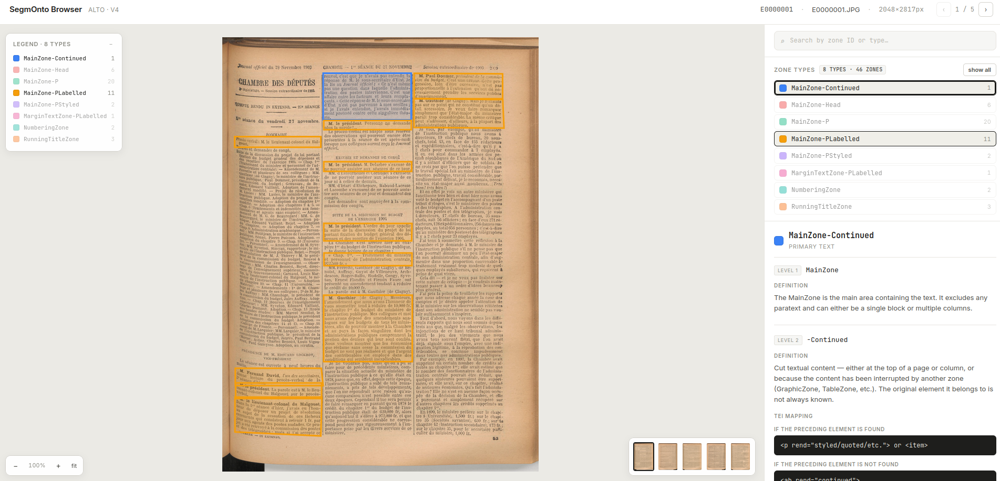

# SegmOnto Annotation Browser

An interactive, serverless viewer for [SegmOnto](https://segmonto.github.io/) region annotations stored as [ALTO v4](https://www.loc.gov/standards/alto/) XML files. Open `index.html` directly from your filesystem (`file://`) or serve it via GitHub Pages — no build step, no server required.



---

## Features

- Pan & zoom image viewer with polygon overlays
- Toggle / isolate zone types; search by zone ID or label
- SegmOnto vocabulary panel: definition, TEI mapping, special cases, may/must specify — shown on click
- Page thumbnail strip for quick navigation
- Works fully offline once opened (fonts & React load from CDN on first visit)

---

## Quick start (local)

```bash
# 1 — clone or download the repo
git clone https://github.com/your-org/your-repo.git
cd your-repo

# 2 — generate data.js from the examples/ folder
python3 generate.py

# 3 — open in Firefox
firefox index.html
# or: xdg-open index.html
```

The only file that is generated (and git-ignored) is `data.js`.  
Everything else — `index.html` and the SegmOnto vocabulary — is static.

---

## Using this repo as a template

> **On GitHub:** click *Use this template → Create a new repository* to get a clean copy.

Then:

1. Replace the contents of `examples/` with your own ALTO XML files and their matching images (same stem, e.g. `page001.xml` + `page001.jpg`).
2. Run `python3 generate.py` locally to preview, or just push — the GitHub Action builds and deploys automatically.

That's it. Nothing else needs to change.

---

## `generate.py`

```
python3 generate.py [EXAMPLES_DIR] [OUTPUT_JS]
```

| Argument | Default | Description |
|---|---|---|
| `EXAMPLES_DIR` | `examples/` | Folder containing `.xml` + image pairs |
| `OUTPUT_JS` | `data.js` | Output path for the generated JS file |

Supported image extensions: `.jpg` `.jpeg` `.png` `.tif` `.tiff` (case-insensitive).  
Each XML file must have a matching image with the same base name in the same folder.

---

## `examples/` folder layout

```
examples/
├── page001.xml      # ALTO v4 file
├── page001.jpg      # matching image (same stem)
├── page002.xml
└── page002.jpg
```

---

## `data.js` structure

`data.js` is auto-generated and git-ignored. It exposes a single global:

```js
window.PAGES = [ /* array of Page objects */ ];
```

### Page object

```jsonc
{
  "id": "page001",          // base filename without extension
  "image": "examples/page001.jpg",  // relative path from data.js to the image
  "width": 2048,            // page width in pixels
  "height": 2817,           // page height in pixels
  "title": "page001.JPG",   // source filename from the ALTO <fileName> element
  "zones": [ /* Zone objects */ ]
}
```

### Zone object

```jsonc
{
  "id": "eSc_textblock_2d8ce35d",   // ALTO TextBlock @ID
  "label": "MainZone-P",            // resolved from ALTO <Tags> + TAGREFS
  "points": "1246 989 1246 1305 1818 1305 1818 989",  // flat "x y x y …" polygon
  "hpos": 1246,   // bounding box left edge (pixels)
  "vpos": 989,    // bounding box top edge (pixels)
  "width": 572,   // bounding box width (pixels)
  "height": 316   // bounding box height (pixels)
}
```

Labels follow the SegmOnto two-level convention: `<Level1>` or `<Level1>-<Level2>` (e.g. `MainZone-PLabelled`).

---

## GitHub Pages deployment

The included workflow (`.github/workflows/deploy.yml`) triggers on every push to `main`:

1. Runs `python3 generate.py examples/ data.js`
2. Uploads the repository root as a Pages artifact
3. Deploys to GitHub Pages

To enable it: go to *Settings → Pages → Source* and select **GitHub Actions**.

---

## Funding

Ce travail a été financé par Inria dans le cadre du DÉFI Inria COLaF.
